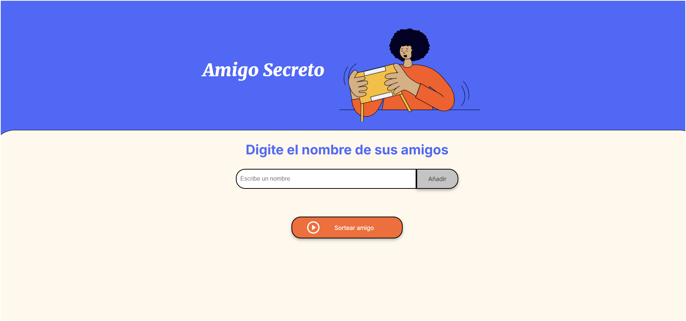

# 🎉 Sorteo de Amigos Secretos

Este proyecto es una aplicación interactiva que permite agregar nombres a una lista y sortear un amigo secreto al azar. También incluye la funcionalidad de eliminar nombres con un botón de papelera 🗑️ y mostrar alertas bonitas en la interfaz en lugar de los típicos cuadros de alerta.

## 🚀 Características
- 📌 Agregar nombres a la lista.
- 🗑️ Eliminar nombres con un botón de papelera.
- 🎁 Sortear un amigo secreto aleatoriamente.
- 🔔 Alertas visuales y agradables para mostrar mensajes.
- 🎨 Diseño estilizado con CSS.

## 🛠️ Tecnologías Utilizadas
- HTML5
- CSS3
- JavaScript (Vanilla JS)

## 📂 Estructura del Proyecto
```
📁 amigo-secreto
│── 📁 assets        # Carpeta para imágenes, íconos y otros archivos estáticos
    │── 📄 amigo-secreto.png    # Imagen de fondo
    │── 📄 challenge.png        # captura de la aplicación
    │── 📄 play_circle_outline.png       # imagen para boton de sorteo
│── 📄 index.html    # Archivo principal de la interfaz
│── 📄 style.css     # Estilos de la aplicación
│── 📄 app.js        # Lógica del sorteo y alertas
```
## 🚀 **Proceso de Seguimiento de Tareas**

El proceso de seguimiento de los requerimientos y avances del proyecto se realizó utilizando **Trello**. Puedes acceder a nuestro tablero de Trello [aquí](https://trello.com/invite/b/67a0f9e1038aad0432af43aa/ATTIcf1402c1d851b3a440bd5c0c364b576d90D61D6D/trello-challenge-amigo-secreto-esp) para ver el estado de las tareas, asignaciones y progreso.

## 📜 Instrucciones de Uso
1. **Descarga o clona este repositorio:**
   ```bash
   git clone https://github.com/tu-usuario/amigo-secreto.git
   ```
2. **Abre `index.html` en tu navegador.**
3. **Ingresa nombres en el campo de texto y agrégalos a la lista.**
4. **Elimina un nombre haciendo clic en la papelera 🗑️.**
5. **Haz clic en "Sortear" para elegir un amigo secreto aleatorio.**
6. **Disfruta de las alertas visuales y la experiencia interactiva.**

## 🎨 Captura de Pantalla


## 📌 Mejoras Futuras
- [ ] Permitir reordenar la lista arrastrando los nombres.
- [ ] Guardar la lista en el almacenamiento local del navegador.
- [ ] Agregar efectos de sonido al agregar o eliminar nombres.

## 📄 Licencia
Este proyecto está bajo la Licencia MIT. Puedes usarlo y modificarlo libremente.

---
📌 ¡Espero que disfrutes este proyecto! Si tienes alguna mejora o sugerencia, ¡házmelo saber! 😊